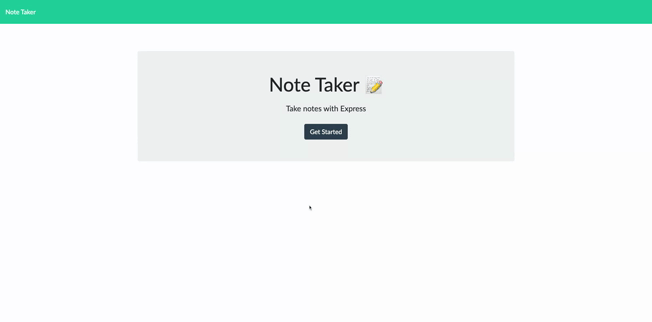

# Express Note Taker

## Description

e you wanting to create a webpage with all of your team members information, but don't have the time to do it? Look no farther then the Employee Profile Template Engine. Simply input the information about each of your team members and when you are done an team.html file will be created and ready to go.

## Table of Contents

[Link](##link)
[Screenshot](##screenshot)
[Installation](##installation)  
[Usage](##usage)  
[License](##license)  
[Contributing](##contributing)  
[Tests](##tests)  
[Questions](##questions)  

## Link
[Express Note Taker](https://floating-sands-65820.herokuapp.com)

## Screenshot

## Installation

Application is hosted on Heroku and does not need to be installed to use.

## Usage

1. Go to [https://floating-sands-65820.herokuapp.com](https://floating-sands-65820.herokuapp.com/).
2. Click on get started.
3. Input note title and note text.
4. Once your note is created and you are ready to save click the save icon.
5. To review previously saved notes you can click the specific note from side list.
6. To delete note click on the trashcan icon next to note in list.
7. To create a new note at any time you can click on the pencil icon.

## License

[MIT](https://choosealicense.com/licenses/mit/)

## Contributing

For repository or clone to your device. For larger contributions create an issue to descirbe the contribution you are adding.

## Tests

There are no tests associated with this application.

## Questions

GitHub: [tdmoore004](https://github.com/tdmoore004)  
Email: [tdmoore004@gmail.com](mailto:tdmoore004@gmail.com)